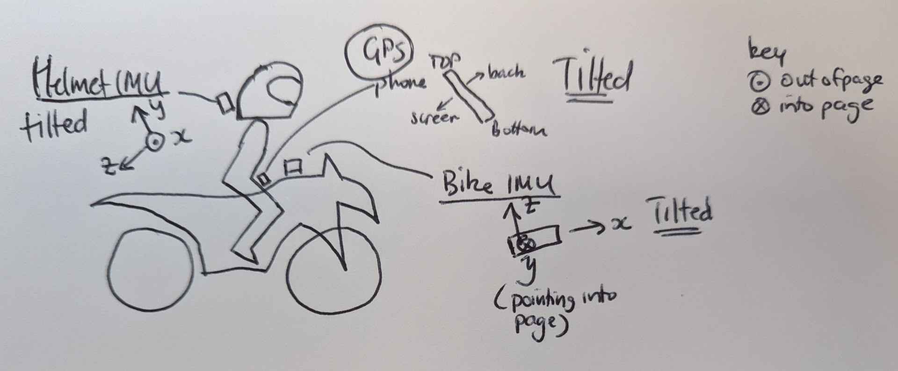

# imu-data
IMU dataset(s) 

00 - phone in jacket front pocket
01 - phone in trouser pocket, IMU on helmet, IMU on bike

## Set 00

GPS and IMU data from mobile phone. Phone in jacket front pocket (substantially vertically oriented, upright, screen facing to the rear).
 
## Set 01

GPS data from phone. Phone in trouser pocket (substantially diagonally oriented, screen down and to the rear).
IMU data from IMU unit on helmet (Y upwards, tilted back)
IMU data from IMU unit on bike (Z upwards, tilted back)



At the very end of the data set, there are two periods of temporary parking with the rider looking straight ahead. The last one is on an almost flat road, and could be used for finding the stationary position of the IMU units on the helmet and bike.

The files have been approximately aligned in time, however it may be necessary to look for vertical accelerations in common between the helmet and bike IMU arising from pot-holes in the road to check/adjust the alignment. The sample rate in all three files is different. 

## Trimming

`sed` was be used to trim lines from the data files to achieve alignment in time.

e.g. for removing the first unnneded lines, but keeping the header:

```
sed -i 2,4128d bike.csv
```

and for removing the last unneeded lines

```
tac bike.csv | sed '1,4764d' | tac  > bike.csv
```


